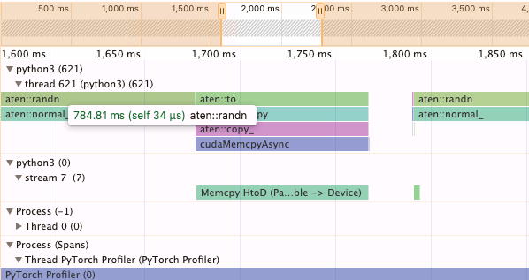

# Notes

CUDA is async so cannot use Python time module. You can only measure the overhead time it takes to launch a kernel, not the actual time the kernel actually takes to run. This is a *key thing to remember* about profiling CUDA.

**Profiling trace of `torch.square`**
| Name          | CPU %   | CPU Time | GPU %   | GPU Time |
|---------------|---------|----------|---------|----------|
| aten::square  | 0.22%   | 20.651us | 0.00%   | 0.000us  |
| aten::pow     | 39.56%  | 3.778ms  | 100.00% | 3.331ms  |

**Profiling trace of `a * a`**
| Name         | CPU %  | CPU Time | GPU %   | GPU Time |
|--------------|--------|----------|---------|----------|
| aten::mul    | 1.62%  | 98.033us | 100.00% | 3.333ms  |

**Profiling trace of `a ** 2`**
| Name         | CPU %  | CPU Time | GPU %   | GPU Time |
|--------------|--------|----------|---------|----------|
| aten::pow    | 1.61%  | 101.702us | 100.00% | 3.339ms  |

**Observation:** aten is a low-level C++ dialect for PyTorch. Looking at the profiling trace, `square` is not a function that does anything, and the main computation lies in function `pow` that sets the value to 2 for square. The `a * a` operation uses `aten::mul` and is slightly faster (3.333ms) compared to `torch.square` (3.331ms) and `a ** 2` (3.339ms) on GPU. Why this phenomenon happens might be rooted in the fact that `mul` is a more popular operation that people spend time optimizing.

**PyTorch profiler**: This is a visual profiler, giving you a Chrome trace in JSON format.
- `Memcpy HtoD (Pageable -> Device)` function: Host to Device copy, which is equivalent to `.cuda()` where sending tensor to GPU.
- **Example:** `aten::to` will be dispatched to `cudaMemcpyAsync`, creating GPU kernel `Memcpy HtoD (Pageable -> Device)`.
- Pageable memory on the host, basically RAM, which can be swap in and out of RAM.

**PyTorch profilder trace**

